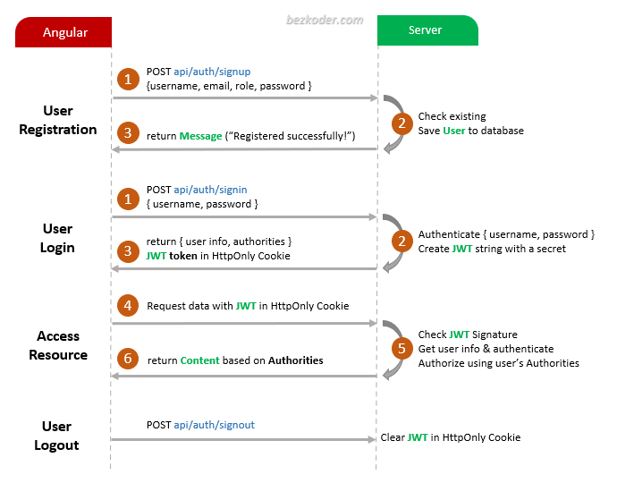
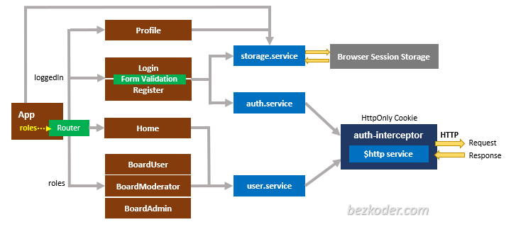

# Angular 12 JWT Authentication with Web API and HttpOnly Cookie example

Build Angular 12 JWT Authentication & Authorization example with Web Api, HttpOnly Cookie and JWT (including HttpInterceptor, Router & Form Validation).
- JWT Authentication Flow for User Registration (Signup) & User Login
- Project Structure with HttpInterceptor, Router
- Way to implement HttpInterceptor
- How to store JWT token in HttpOnly Cookie
- Creating Login, Signup Components with Form Validation
- Angular Components for accessing protected Resources
- How to add a dynamic Navigation Bar to Angular App
- Working with Browser Session Storage

## Flow for User Registration and User Login
For JWT – Token based Authentication with Web API, we’re gonna call 2 endpoints:
- POST `api/auth/signup` for User Registration
- POST `api/auth/signin` for User Login
- POST `api/auth/signout` for User Login

You can take a look at following flow to have an overview of Requests and Responses that Angular 12 JWT Authentication & Authorization Client will make or receive.

## Angular JWT App Diagram with Router and HttpInterceptor

For more detail, please visit:
> [Angular 12 JWT Authentication & Authorization with Web API](https://www.bezkoder.com/angular-12-jwt-auth-httponly-cookie/)

## With Spring Boot back-end

> [Angular 12 + Spring Boot: JWT Authentication and Authorization example](https://www.bezkoder.com/angular-12-spring-boot-jwt-auth/)

## With Node.js Express back-end

> [Angular 12 + Node.js Express: JWT Authentication and Authorization example](https://www.bezkoder.com/node-js-angular-12-jwt-auth/)

Run `ng serve --port 8081` for a dev server. Navigate to `http://localhost:8081/`.

## More practice
> [Angular JWT Refresh Token example with Http Interceptor](https://www.bezkoder.com/angular-12-refresh-token/)

> [Angular CRUD Application example with Web API](https://www.bezkoder.com/angular-12-crud-app/)

> [Angular Pagination example | ngx-pagination](https://www.bezkoder.com/angular-12-pagination-ngx/)

> [Angular File upload example with progress bar & Bootstrap](https://www.bezkoder.com/angular-12-file-upload/)

Fullstack with Node.js Express:
> [Angular + Node.js Express + MySQL example](https://www.bezkoder.com/angular-12-node-js-express-mysql/)

> [Angular + Node.js Express + PostgreSQL example](https://www.bezkoder.com/angular-12-node-js-express-postgresql/)

> [Angular + Node.js Express + MongoDB example](https://www.bezkoder.com/angular-12-mongodb-node-js-express/)

> [Angular + Node.js Express: File upload example](https://www.bezkoder.com/angular-12-node-js-file-upload/)

Fullstack with Spring Boot:
> [Angular + Spring Boot + MySQL example](https://www.bezkoder.com/angular-12-spring-boot-mysql/)

> [Angular + Spring Boot + PostgreSQL example](https://www.bezkoder.com/angular-12-spring-boot-postgresql/)

> [Angular + Spring Boot + MongoDB example](https://www.bezkoder.com/angular-12-spring-boot-mongodb/)

> [Angular + Spring Boot: File upload example](https://www.bezkoder.com/angular-12-spring-boot-file-upload/)

Fullstack with Django:
> [Angular 12 + Django example](https://www.bezkoder.com/django-angular-12-crud-rest-framework/)

> [Angular + Django + MySQL](https://www.bezkoder.com/django-angular-mysql/)

> [Angular + Django + PostgreSQL](https://www.bezkoder.com/django-angular-postgresql/)

> [Angular + Django + MongoDB](https://www.bezkoder.com/django-angular-mongodb/)

Serverless with Firebase:
> [Angular 12 Firebase CRUD with Realtime DataBase | AngularFireDatabase](https://www.bezkoder.com/angular-12-firebase-crud/)

> [Angular 12 Firestore CRUD example with AngularFireStore](https://www.bezkoder.com/angular-12-firestore-crud-angularfirestore/)

> [Angular 12 Firebase Storage: File Upload/Display/Delete example](https://www.bezkoder.com/angular-12-file-upload-firebase-storage/)

Integration (run back-end & front-end on same server/port)
> [How to integrate Angular with Node.js Restful Services](https://www.bezkoder.com/integrate-angular-12-node-js/)

> [How to Integrate Angular with Spring Boot Rest API](https://www.bezkoder.com/integrate-angular-12-spring-boot/)